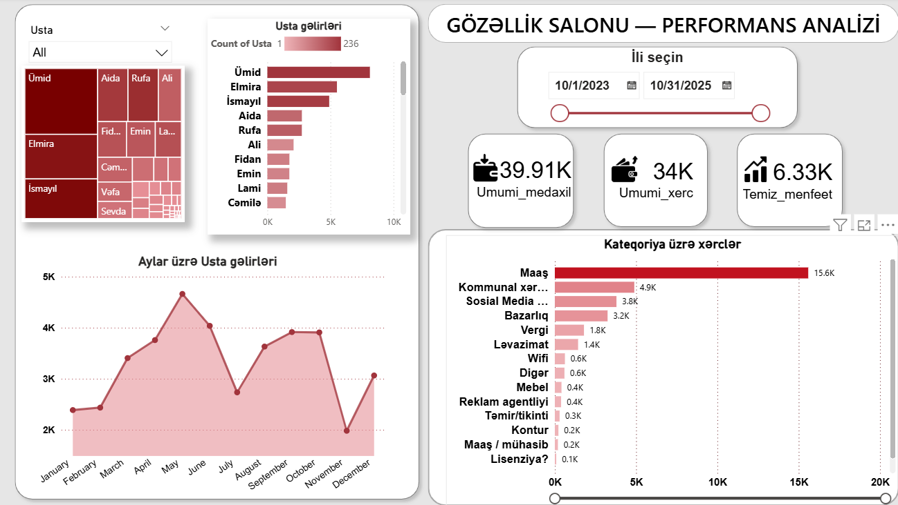
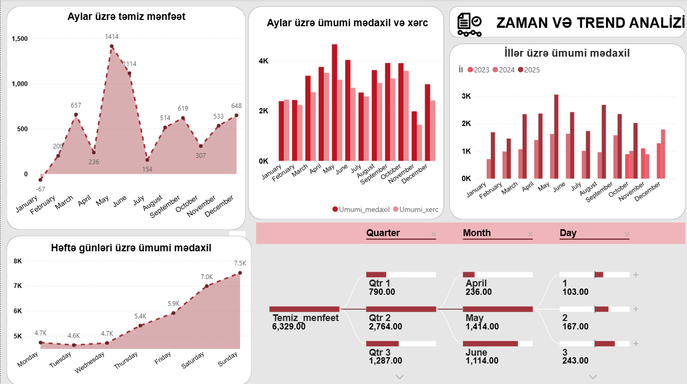

# Beauty Salon Performance Dashboard 📊

An end-to-end Power BI business intelligence solution designed to track, analyze, and optimize the operational and financial performance of a beauty salon.

> ⚠️ **Data Confidentiality Notice:** The data source and the Power BI `.pbix` file are kept private to protect customer privacy and business confidentiality. All metrics, visuals, and methodologies are demonstrated below.

---

## 🎯 Project Objective
The main goal of this dashboard is to help salon stakeholders monitor daily revenue, track stylist (staff) performance, and identify peak hours/popular services to improve operational efficiency.

## 🛠️ Tech Stack & Skills Used
* **Power BI Desktop** - Data modeling & Visualization
* **Power Query** - ETL (Extract, Transform, Load) processes & Data cleaning
* **DAX (Data Analysis Expressions)** - Calculated columns and measures for custom KPIs

## 🖼️ Dashboard Preview

Here is a look at the interactive pages of the Power BI dashboard:

### Page 1: Stylist Performance Analysis (Usta Performansı Analizi)
This page focuses on individual stylist performance, analyzing which team members contribute most to salon sales, service delivery, and customer interactions.


### Page 2: Time & Trend Analysis (Zaman və Trend Analizi)
This page provides in-depth insights into financial trends over time, tracking monthly net profit, revenue vs. expenses, weekly performance, and a drill-down decomposition of net profit.


## 📈 Analytical Logic & DAX Formulas

Since the database contains separate cash inflow and outflow logs, custom measures and a dynamic calendar table were developed to build a relational data model and perform time-series analysis.

### 1. Key Business Metrics (Measures)

* **Ümumi Mədaxil (Total Revenue):**
  Calculates the total revenue generated from salon services.
  ```dax
  Umumi_medaxil = SUM('Kassa mədaxil'[Qazanc, AZN])
* **Ümumi Xərc (Total Expenses):**
  Calculates the total operational expenses of the salon.
   ```dax
  Umumi_xerc = SUM('Kassa xərclər'[Xərc, AZN])
* **Təmiz Mənfəət (Net Profit):**
  Calculates the net profit by subtracting total expenses from total revenue.
    ```dax
    Temiz_menfeet = [Umumi_medaxil] - [Umumi_xerc]
### 2.Dynamic Calendar Table (Time Intelligence)
 To enable advanced date filtering (slicers) and trend analysis across different tables, a custom Təqvim (Calendar) table was created using DAX:
 ```dax

 Teqvim = 
VAR MinDate = MIN('Kassa mədaxil'[Tarix])
VAR MaxDate = MAX('Kassa mədaxil'[Tarix])
RETURN
ADDCOLUMNS (
    CALENDAR (MinDate, MaxDate),
    "İl", YEAR([Date]),
    "Ay", FORMAT([Date], "MMMM"),
    "Ay Nömrəsi", MONTH([Date]),
    "Həftənin Günü", FORMAT([Date], "dddd")
)
```
## 📊 Business Insights & Data Storytelling

Instead of just visualizing data, this project uncovers the "why" behind the numbers, mapping financial anomalies to seasonal trends, local cultural behaviors, and operational risks.

### 1. Seasonal & Cultural Anomalies 📅
* **February Deficit (-67 AZN):** The shortest month of the year marked a post-New Year slump and pre-wedding stagnation. While revenue dipped sharply, fixed overheads and high winter utility costs remained constant, pushing the salon into a net loss.
* **July Wedding Slump (-2 AZN):** Profit hit near-zero due to local cultural factors. The observance of the holy month of Muharram halted all weddings, completely drying up the salon’s highest-margin services (bridal prep, party hair, and makeup).
* **The March Paradox (+487 AZN Spike):** Despite Ramadan causing an expected slowdown, a massive 3-to-5-day customer rush during International Women's Day (March 8) and the Novruz holiday completely offset the quiet days, leading to a massive profit surge.

### 2. Operational Risks & Costs ⚠️
* **The "Top 3" Stylist Dependency:** Although the salon has multiple staff members, **60-70% of total revenue** relies solely on three top stylists (Umid, Elmira, and Ismayil). This presents a high operational risk; if one leaves or takes concurrent leave, revenues will drop by half.
* **Marketing ROI (3.8K AZN):** Social media/SMM marketing is the second largest expense after salaries. The next analytical step is conducting an ROI analysis to correlate ad spending peaks with revenue growth.
* **Weekend Overbooking Phenomenon:** Weekend revenue is double that of weekdays due to customer work schedules. This causes intense weekend bottlenecks (overbooking) while leaving stylists largely underutilized on weekdays.

---

## 💡 Strategic Recommendations for FY2027

To mitigate seasonal risks and optimize salon operations, the following data-driven strategies are proposed:

1. **De-seasonalize Revenue:** During low periods (February and July), transition marketing focus away from wedding packages toward daily care, advanced cosmetology, and nail-art campaigns.
2. **Mitigate Dependency Risk:** Stagger vacation schedules for the top three stylists (Umid, Elmira, Ismayil) to ensure at least two are always active.
3. **Smooth Weekend Demand:** Introduce "Weekday Package Deals" or loyalty discounts from Monday to Wednesday to incentivize budget-conscious clients to book during off-peak hours.

## 🚀 Roadmap & Next Steps (Feedback Integration)

* **I am continuously improving this project. The upcoming updates will include:**

* **UI/UX Refinement: Redesigning color palettes and layouts for better readability and a more polished look based on stakeholder feedback.**

* **Performance Optimization: Optimizing complex DAX measures to reduce visual loading times.**

* **Advanced Analytics: Introducing customer retention and repeat-visit frequency analysis.**
